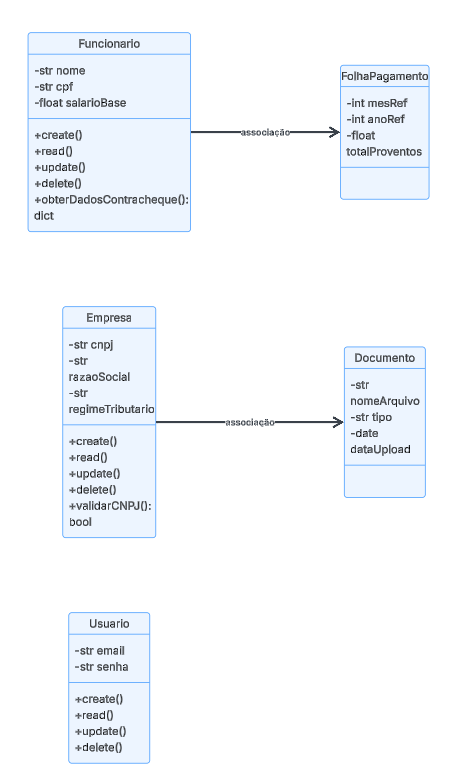

# Visão Lógica - Sistema ContabSys

Este documento descreve a estrutura interna e o comportamento lógico do sistema **ContabSys**, detalhando as classes, seus atributos, métodos e os algoritmos fundamentais para o funcionamento das rotinas contábeis, fiscais e trabalhistas.

## 1. Diagrama de Classes Geral (Estrutura Estática)

O diagrama de classes representa a espinha dorsal do sistema, definindo como os dados são estruturados e quais operações cada entidade pode realizar.

### 1.1. Definição das Classes Principais

| Classe | Atributos (Privados) | Métodos (Públicos) |
| :--- | :--- | :--- |
| **Empresa** | `id: int`, `cnpj: str`, `razaoSocial: str`, `regimeTributario: str` | `cadastrar()`, `alterar()`, `validarCNPJ()`, `listar()` |
| **Funcionario** | `id: int`, `nome: str`, `cpf: str`, `salarioBase: float` | `cadastrar()`, `editar()`, `obterDadosContracheque()` |
| **FolhaPagamento** | `id: int`, `mesRef: int`, `anoRef: int`, `totalProventos: float`, `totalDescontos: float` | `processarFolha()`, `gerarPDF()`, `cancelarProcessamento()` |
| **Usuario** | `id: int`, `email: str`, `senha: str` | `realizarLogin()`, `recuperarSenha()`, `validarSessao()` |
| **Documento** | `id: int`, `nomeArquivo: str`, `tipo: str`, `dataUpload: date` | `anexar()`, `excluir()`, `vincularEmpresa()` |

*Nota: A tipagem segue o padrão Python conforme definido na modelagem técnica.*

### 1.2. Relacionamentos
* **Empresa (1) --- (1..*) Funcionario**: Uma empresa possui um ou mais funcionários (Composição).
* **Empresa (1) --- (0..*) Documento**: Uma empresa pode ter diversos documentos vinculados.
* **Funcionario (1) --- (0..*) FolhaPagamento**: Um funcionário possui um histórico de folhas mensais.
* **Empresa (1) --- (0..*) FolhaPagamento**: O processamento da folha é vinculado à empresa contratante.

---

## 2. Diagramas de Atividades (Comportamento Dinâmico)

Os diagramas abaixo descrevem o fluxo lógico de operações críticas dentro do sistema.

### 2.1. Algoritmo de Processamento de Folha de Pagamento
Este fluxo detalha a lógica interna do método `processarFolha()`:

1. **Início**: Selecionar Empresa e Mês/Ano de competência.
2. **Busca**: Localizar todos os funcionários com status "Ativo".
3. **Loop de Cálculo**: Para cada funcionário:
    * Calcular **Proventos** (Salário + Horas Extras + Adicionais).
    * Calcular **INSS** (Baseado na tabela progressiva vigente).
    * Calcular **IRRF** (Baseado na tabela da Receita Federal após dedução de dependentes e INSS).
    * Calcular **FGTS** (8% sobre a remuneração).
    * Gerar Valor Líquido.
4. **Finalização**: Consolidar totais da empresa e gerar guias de recolhimento (GPS/FGTS).
5. **Saída**: Gerar contracheques em PDF e notificar o contador.
6. **Fim**.

### 2.2. Algoritmo de Apuração Fiscal
Detalha a inteligência para o cálculo automático de impostos:

1. **Início**: Identificar regime tributário da empresa (Simples, Presumido ou Real).
2. **Processamento**:
    * **Simples Nacional**: Aplicar alíquota do Anexo correspondente sobre a Receita Bruta.
    * **Lucro Presumido**: Calcular PIS/COFINS (3.65%) e IRPJ/CSLL por presunção.
    * **Lucro Real**: Apurar lucro líquido e aplicar alíquotas (IRPJ 15% + Adicional).
3. **Geração**: Emitir guias de pagamento (DAS/DARF).
4. **Fim**.

---

## 3. Conformidade e Qualidade
* **LGPD**: Dados sensíveis como CPF e Salários são protegidos por níveis de acesso.
* **Precisão**: Todos os cálculos seguem as tabelas oficiais do Governo Federal (eSocial/SPED).
* **Confiabilidade**: Taxa de erros inferior a 0,1% nas operações críticas.