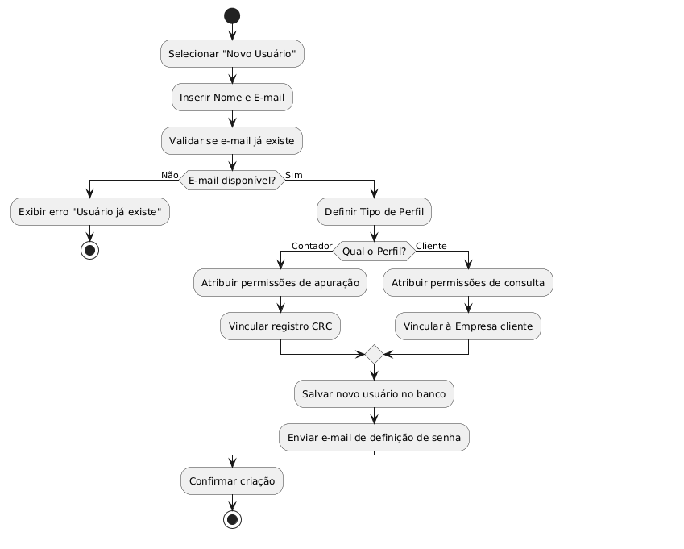
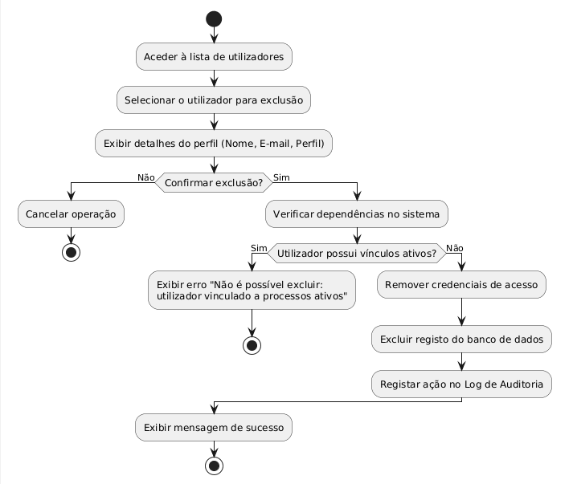
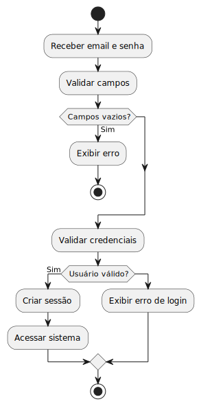
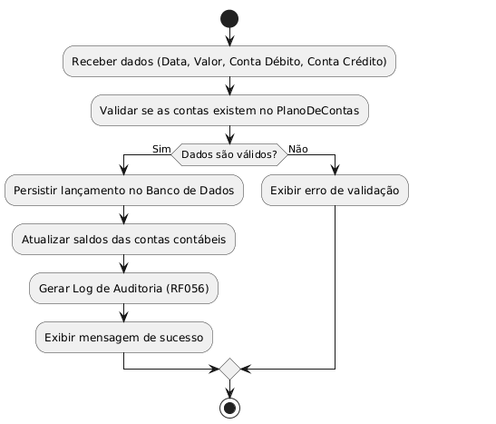
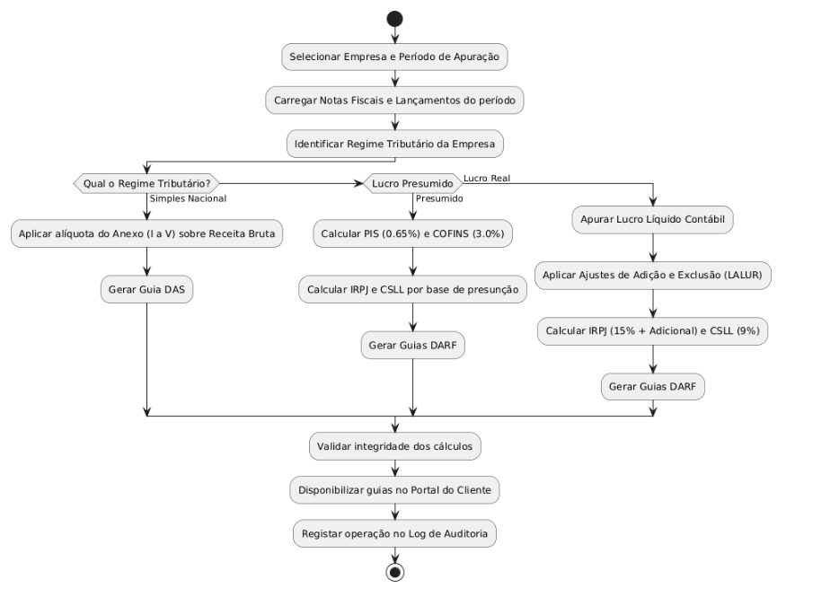
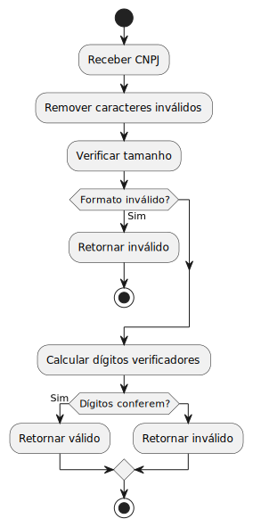
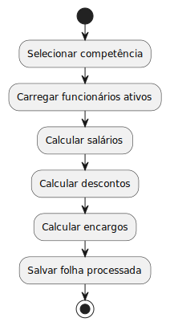
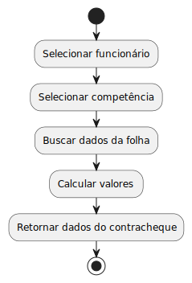
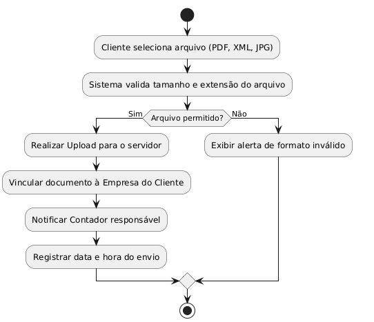
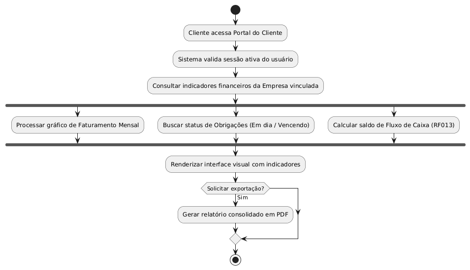

# Visão Lógica - ContabSys

Esta seção detalha a estrutura interna do sistema **ContabSys**, apresentando a organização das classes e o comportamento dos algoritmos que sustentam as operações contábeis, fiscais e de RH.

---

## 1. Diagrama de Classes Consolidado

### Descrição das Entidades Principais
* **Empresa:** Core do sistema, centraliza os lançamentos, funcionários e obrigações fiscais.
* **Usuários (Herança):** Estrutura que diferencia permissões entre Administrador, Contador e Cliente.
* **LançamentoContabil:** Base para a geração de relatórios como DRE e Balanço.
* **FolhaPagamento:** Entidade responsável pelo cálculo de proventos e descontos.

---

## 2. Algoritmos e Fluxos de Atividades

Os diagramas de atividades abaixo detalham a inteligência de processamento de cada módulo, garantindo a conformidade com as regras de negócio.

### 2.1 Módulo de Administração e Segurança
Focado na gestão de acesso e integridade do sistema (**RF001, RF003, RF056**).

* **Gerenciar Usuários:** Fluxo de criação com distinção de perfil (Contador vs Cliente).
    
* **Exclusão de Usuário:** Processo seguro com verificação de dependências.
    
* **Autenticação:** Validação de credenciais e controle de sessão.
    

### 2.2 Módulo Contábil e Fiscal
Lógica para processamento de impostos e escrituração (**RF005, RF019, RF020**).

* **Registrar Lançamento:** Fluxo de classificação no Plano de Contas.
    
* **Apurar Tributos:** Algoritmo de cálculo baseado no regime tributário (Simples, Presumido ou Real).
    
* **Validação de Dados:** Inteligência para garantir integridade de documentos.
    

### 2.3 Módulo Trabalhista (RH)
Processamento de folha e gestão de colaboradores (**RF039, RF046**).

* **Processar Folha de Pagamento:** Cálculo automático de INSS, IRRF e FGTS.
    
* **Gestão de Funcionários:** Manutenção de registros e obtenção de contracheques.
    

### 2.4 Portal do Cliente
Interação do cliente com o escritório contábil (**RF051, RF053**).

* **Enviar Documentos:** Fluxo de upload e notificação ao contador.
    
* **Visualizar Dashboards:** Renderização de indicadores financeiros e fiscais.
    

---

## 3. Matriz de Rastreabilidade Lógica

| Algoritmo | Requisito Relacionado | Classe Responsável |
| :--- | :--- | :--- |
| Apurar Tributos | RF019 / RF020 | Contador |
| Processar Folha | RF039 / RF046 | FolhaPagamento |
| Registrar Lançamento | RF005 | LancamentoContabil |
| Validar CNPJ | RF001 | Empresa |
| Gerenciar Acessos | RF003 | Administrador |