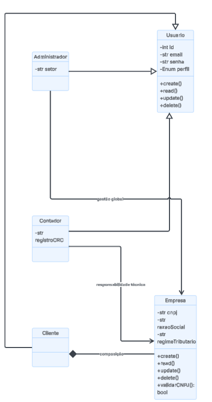
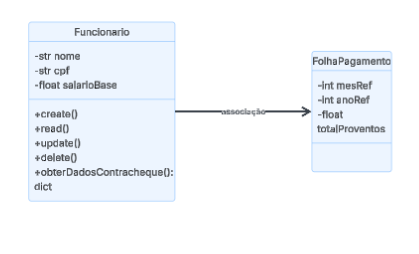

# Visão Lógica - Sistema ContabSys

Este documento descreve a estrutura interna e o comportamento lógico do sistema **ContabSys**, detalhando as classes, seus atributos, métodos e os algoritmos fundamentais para o funcionamento das rotinas contábeis, fiscais e trabalhistas.

## 1. Diagramas de Classes (Estrutura Estática)

O diagrama de classes representa a espinha dorsal do sistema, definindo como os dados são estruturados e as permissões de cada perfil.

### 1.1. Especialização de Usuários e Gestão de Empresas
Este diagrama foca na hierarquia de usuários (Administrador, Contador e Cliente) e como cada um interage com a entidade Empresa, garantindo o isolamento de dados conforme a LGPD.

### 1.2. Estrutura de RH e Folha de Pagamento
Este diagrama detalha a relação entre funcionários e o processamento de suas respectivas folhas de pagamento.

---

## 2. Definição das Classes Principais

| Classe | Atributos (Privados) | Métodos (Públicos) |
| :--- | :--- | :--- |
| **Usuario** (Base) | `id: int`, `email: String`, `senha: String`, `perfil: Enum` | `create()`, `read()`, `update()`, `delete()` |
| **Administrador** | `setor: String` | `gerenciarUsuarios()`, `restaurarBackup()` |
| **Contador** | `registroCRC: String` | `apurarTributos()`, `encerrarExercicio()` |
| **Cliente** | `empresaVinculada: Empresa` | `enviarDocumentos()`, `visualizarDashboards()` |
| **Empresa** | `cnpj: String`, `razaoSocial: String`, `regimeTributario: String` | `create()`, `validarCNPJ()`, `listar()` |
| **Funcionario** | `nome: String`, `cpf: String`, `salarioBase: Double` | `obterDadosContracheque()`, `create()` |
| **FolhaPagamento** | `mesRef: int`, `anoRef: int`, `totalProventos: Double` | `processarFolha()`, `gerarPDF()` |

*Nota: A tipagem foi atualizada para o padrão Java/C#, condizente com o desenvolvimento de sistemas corporativos.*

---

## 3. Relacionamentos e Permissões (RF003)
* **Herança**: Administrador, Contador e Cliente herdam de Usuario.
* **Gestão Global**: O Administrador gerencia todas as empresas do sistema.
* **Responsabilidade Técnica**: O Contador é associado às empresas que ele apura.
* **Composição (Cliente -> Empresa)**: O Cliente possui um vínculo estrito 1:1 com sua empresa, garantindo que ele não acesse dados de terceiros.

---

## 4. Diagramas de Atividades (Comportamento Dinâmico)

### 4.1. Algoritmo de Processamento de Folha de Pagamento
1. **Busca**: Localizar todos os funcionários com status "Ativo".
2. **Loop de Cálculo**: Para cada funcionário, calcular Proventos, INSS, IRRF e FGTS.
3. **Saída**: Gerar contracheques em PDF e notificar o contador.

### 4.2. Algoritmo de Apuração Fiscal
1. **Identificação**: Verificar se o regime é Simples Nacional, Lucro Presumido ou Real.
2. **Cálculo**: Aplicar as alíquotas correspondentes sobre a Receita Bruta.
3. **Geração**: Emitir guias de pagamento (DAS/DARF).